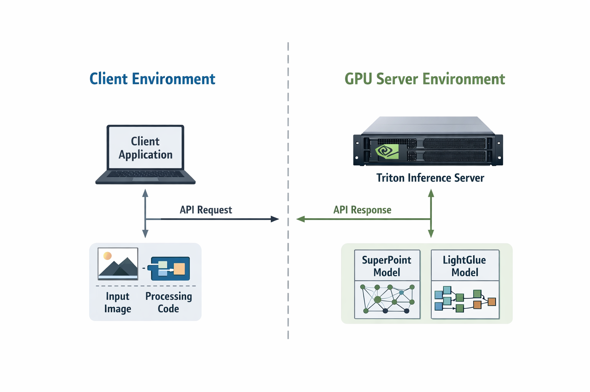
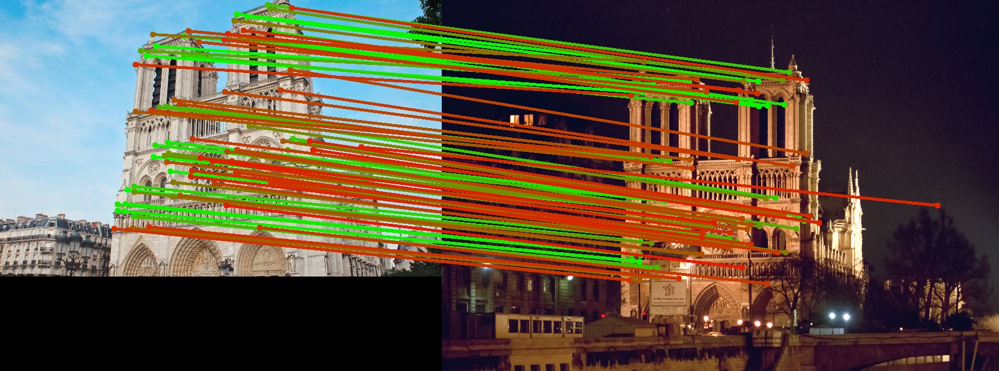

# EasyTensorRT

A **Dockerized Triton inference service** for SuperPoint and LightGlue (and other models) with support for both **ONNX** and **TensorRT (TRT)** models.

This repository provides:

* ready-to-use Triton model serving
* ONNX (portable) and TRT (optimized) models
* simple Python gRPC client examples
* clean separation between **GPU inference environment** and **application logic**



## ✨ Features

* 🚀 Serve SuperPoint and LightGlue via Triton
* 🔁 Support both ONNXRuntime and TensorRT backends
* 🐳 Fully Dockerized deployment
* 🧩 Easy integration via gRPC client
* 🔒 Isolated GPU environment (no CUDA conflicts in other repos)
* ⚙️ Flexible: development (ONNX) → production (TRT)

## 🧠 Motivation

Many projects need SuperPoint and LightGlue, but bundling:

* CUDA
* PyTorch
* TensorRT
* model weights

into every repo leads to **dependency conflicts and maintenance overhead**.

This repo solves that by:

👉 Running all GPU inference inside a **Triton server (Docker)**
👉 Letting other projects interact via a **lightweight client**

## Support Models

* [SuperPoint](https://github.com/rpautrat/SuperPoint)
* [LightGlue](https://github.com/cvg/lightglue)
* [Depth-Anything-3](https://github.com/ByteDance-Seed/Depth-Anything-3) with [Depth-Anything-V3-ONNX](https://huggingface.co/gggliuye/Depth-Anything-V3-ONNX)

## 🏗️ Architecture

```
Your Application
        ↓
   gRPC Client
        ↓
Dockerized Triton Server
   ├── SuperPoint (ONNX / TRT)
   ├── LightGlue  (ONNX / TRT)
   └── Other Models  (ONNX / TRT)
```

## 🚀 Quick Start

### 1. Obtain the docker image

Pull directly from ghcr `docker pull ghcr.io/mapmindai/tritonserver_amd64:latest`.
(or you could build it if you wish to `docker build -f artifacts/docker/server.dockerfile -t tritonserver_amd64 artifacts/docker/`)

### 1. Prepare model repository

Build TensorRT Engine, Use NVIDIA TensorRT container:

### 3. Start Triton server

* Start the ONNX version : `./run_server_onnx.sh`
  * Check logs with `docker logs -f tritonserver`.
* Start the TensorRT version : `./run_server_onnx.sh`
  * In the first run, the TensorRT plan files will be create, it might take a while.
  * Check logs with `docker logs -f tritonserver_trt`.
* Start the ONNX version using **CPU** : `./run_server_cpu.sh`

### 3. Run client example

```bash
python triton_client/lightglue.py
```

```bash
python triton_client/superpoint.py
```



## ⚙️ ONNX vs TensorRT

| Type | Pros           | Cons         | Super Point (GTX 1650Ti) |  Light Glue (GTX 1650Ti) |
| ---- | -------------- | ------------ |-------------|-------------|
| ONNX | portable, easy | slower       |   54.6ms    |   29.31ms   |
| TRT  | fastest        | GPU-specific |   26.5ms    |   31.36ms   |

* Use **ONNX** for development
* Use **TensorRT** for production (build per GPU)
